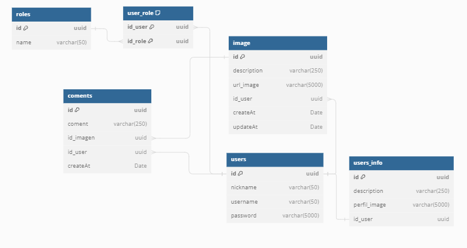

# SocialPablo

En este repositorio se contienen todos los archivos del desarrollo de una red social en la cual puedes publicar tus imagenes y comentar las imagenes de tus amigos.

Se desarrollaron dos servidores con lenguajes distintos, dichos lenguajes son Typescript y Java. Ambos servidores hacen las mismas tareas y el frontend es agnostico de acuerdo a que servidor este conectado. Esto se hizo con la finalidad de poder prácticar con ambos lenguajes, así que solo es cuestion de definir el puerto del servidor que este activo en el frontend para que este funcione de manera correcta.

## Archivos

- [Servidor de Typescript](./serverts/ "Servidor de Typescript")
- [Servidor de Java](./serverjava/ "Servidor de Java")
- [Frontend](./socialpage/ "Frontend")


## Servidores

Como se mencionó, ambos servidores elaboran las mismas tareas, por lo que solo es necesario activar uno. Los puertos en los que corren estos servidores de manera local `localhost` son los siguientes:

- Servidro de Typescript: `3010`
- Servidor de Java: `3009`

### Datos y relaciones

Para este proyecto se utilizó [Postgresql](https://www.postgresql.org/ "Postgresql") y las tablas con sus relaciones se muestran en la siguiente imagen.

[](./tablesDiagrams.txt "Tabla")

### Solicitudes a los servidores

Las solicitudes y respuestas a los diferentes puntos de salida de los servidores son las mismas y se deben de ejecurar de las siguientes formas:

#### Login Request

``` http
POST /login
```

- Request body


```json
{
	"username":"string",
	"password":"string"
}
```

- Response

```json
{
	"token": "string",
	"username": "string"
}
```

#### Register Request

```http
POST /api/user/register
```

- Request body

```JSON
{
	"username":"string",
	"nickname":"string",
	"password":"string",
	"description":"string",
	"perfilImage":"string"
}
```

- Response

```JSON
{
    "id": "UUID",
	"username": "string",
	"nickname": "string",
	"userInfo": {
		"id": "UUID",
		"description": "string",
		"perfilImage": "string"
	},
	"roles": [
		{
			"id": "UUID",
			"name": "string"
		}
	]
}
```

#### Get Home

```http
GET /api/image
```

- Request header

```JSON
{
    "Authorization":"Bearer <Token>"
}
```

- Respnse

```JSON
{
	"dataInfo": {
		"username": "string",
		"nickname": "string"
	},
	"images": [
		{
			"id": "UUID",
			"description": "string",
			"urlImage": "string",
			"createAt": "string",
			"user": {
				"id": "UUID",
				"username": "string",
				"nickname": "string",
				"userInfo": {
					"perfilImage": "string"
				}
			},
			"coments": 1 // Integer
		}
	]
}
```

#### Get One Image

```http
GET /api/image/{id_image}
```

- Request header

```JSON
{
    "Authorization":"Bearer <Token>"
}
```

- Response body

```JSON
{
	"dataInfo": {
		"username": "string",
		"nickname": "string"
	},
	"images": {
		"id": "UUID",
		"description": "string",
		"urlImage": "string",
		"createAt": "string",
		"user": {
			"id": "UUID",
			"username": "string",
			"nickname": "string",
			"userInfo": {
				"perfilImage": "string"
			}
		},
		"coments": [
			{
				"id": "UUID",
				"coment": "string",
				"createAt": "string",
				"user": {
					"id": "UUID",
					"username": "string",
					"nickname": "string",
					"userInfo": {
						"perfilImage": "string"
					}
				}
			}
		]
	}
}
```

#### Get Perfil

```http
GET /api/user/perfil
```

- Request header

```JSON
{
    "Authorization":"Bearer <Token>"
}
```

- Response body

```JSON
{
	"id": "UUID",
	"username": "string",
	"nickname": "string",
	"userInfo": {
		"id": "UUID",
		"description": "string",
		"perfilImage": "string"
	},
	"images": [
		{
			"id": "UUID",
			"description": "string",
			"urlImage": "string",
			"createAt": "string",
			"user": {
				"id": "UUID",
				"username": "string",
				"nickname": "string",
				"userInfo": {
					"perfilImage": "string"
				}
			},
			"coments": 1 //Integer
		}
	]
}
```

#### Get Friend Perfil

```http
GET /api/user/perfil/{username}
```

- Request header

```JSON
{
    "Authorization":"Bearer <Token>"
}
```

- Response body 

```JSON
{
	"dataInfo": {
		"username": "pablo123",
		"nickname": "Jose Pablo"
	},
	"perfil": {
		"id": "UUID",
		"username": "string",
		"nickname": "string",
		"userInfo": {
			"id": "UUID",
			"description": "string",
			"perfilImage": "string"
		},
		"images": [
			{
				"id": "UUID",
				"description": "string",
				"urlImage": "string",
				"createAt": "string",
				"user": {
					"id": "UUID",
					"username": "string",
					"nickname": "string",
					"userInfo": {
						"perfilImage": "string"
					}
				},
				"coments": 1 //Integer
			}
		]
	}
}
```

#### Public image

```http
POST /api/image/addImage
```

- Request header 

```JSON
{
    "Authorization":"Bearer <Token>"
}
```

- Request body

```JSON
{
	"description":"string",
	"urlImage":"string"
}
```

- Response body

```JSON
{
	"message":"string"
}
```

#### Add Comment

```http
POST /api/coment/{id_image}
```

- Request header

```JSON
{
    "Authorization":"Bearer <Token>"
}
```

- Request body

```JSON
{
	"coment":"string"
}
```

- Response body

```JSON
{
	"message":"string"
}
```
#### Delete Comment

```http
DELETE /api/coment/{id_comment}
```

- Request header

```JSON
{
    "Authorization":"Bearer <Token>"
}
```

- Response body

`Not Content`

#### Delete image

```http
DELETE /api/image/{id_image}
```

- Request header

```JSON
{
    "Authorization":"Bearer <Token>"
}
```

- Response body

`Not Content`

#### Delete user

```http
DELETE /api/user
```

- Request header

```JSON
{
    "Authorization":"Bearer <Token>"
}
```

- Response body

`Not Content`

#### Error response

Si hay algún error en cualquier solicitud se respndera con el siguiente json

```JSON
{
	"statusCode": "integer",
	"error":"string",
	"message": "string"
}
```