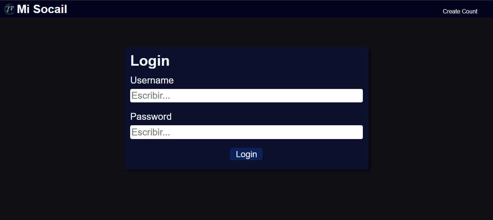
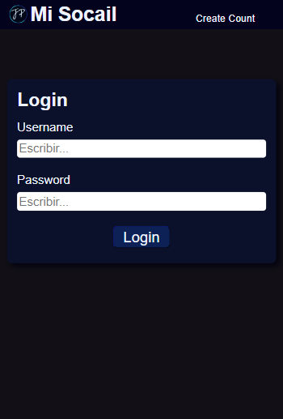
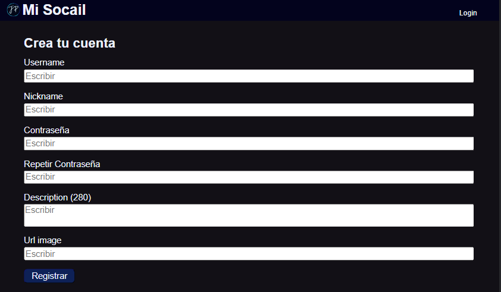
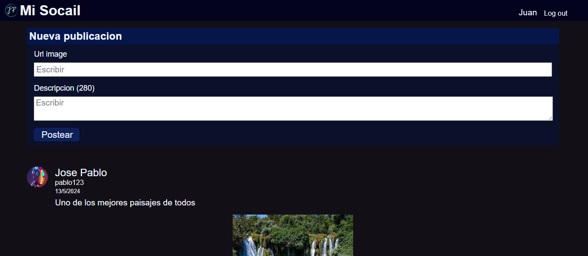
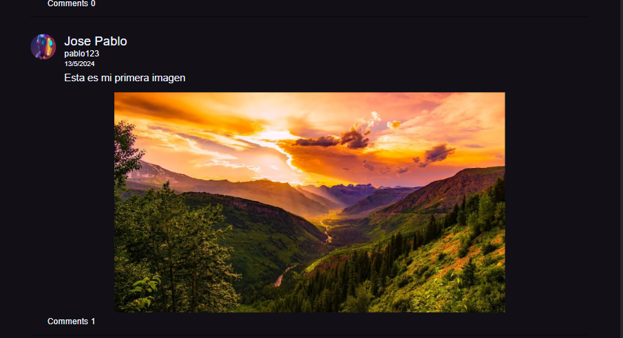
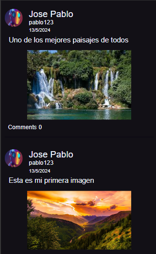
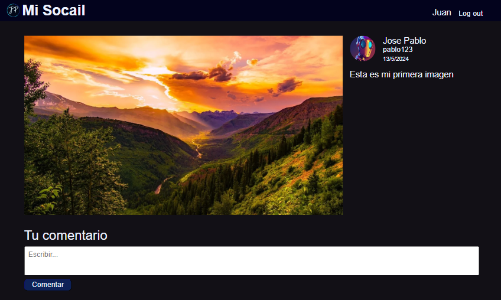
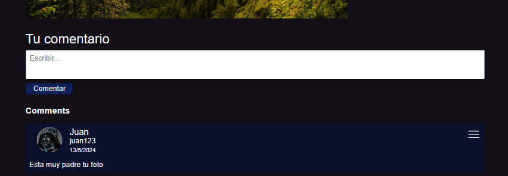
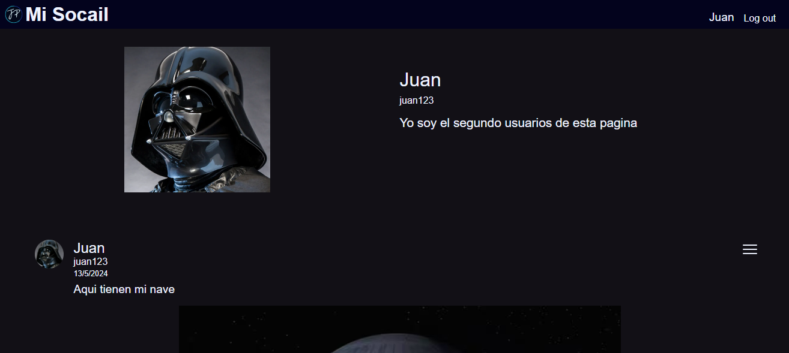
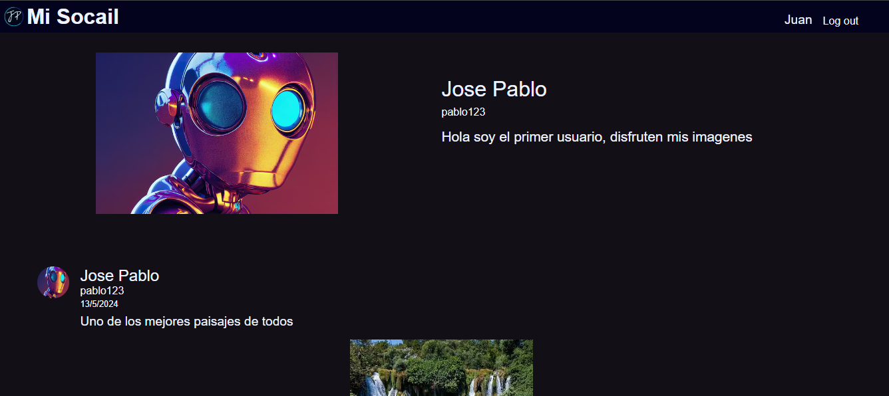

# Social Pablo Page

En esta sección se muestran todos los archivos de la pagina web de la aplicacion Social Pablo

## Tecnologías

- Lenguajes: Typescript, Html, SCSS
- Librerías: React, React Redux, Redux - Toolkit`, Vite
- Entornos: NodeJS

## Instalación

Al clonar o instalar todos los archivos abra en su consola esta seccion y ejecute el comando
`npm install`

En el archivo `package.json` se encuentran tres scrips para ejecutar la pagina o crear los archivos estaticos.

```JSON
  "scripts": {
    "dev": "vite --host",
    "build": "tsc && vite build",
    "lint": "eslint . --ext ts,tsx --report-unused-disable-directives --max-warnings 0",
    "preview": "vite preview"
  },
```

Con el comando `npm run dev` se ejecuta el modo desarrollado de la pagina, antes de ejecutar este comando asegurese de haber inicializado uno de los dos servicios y agregar su respectivo puerto.

## Capturas

La pagina cuenta con 5 secciones principales: Login, Registrar, Home, Imagen completa y perfil


### Sección Login



#### Login responsive



### Sección registrar



### Sección Home





#### Home responsive



### Sección Imagen completa





### Sección perfil



#### Perfil de un amigo



#### Menu para borrar imagen o comentario


Solamente se pueden borrar tus propias imagens, comentarios y los comentarios de tus imagenes.
